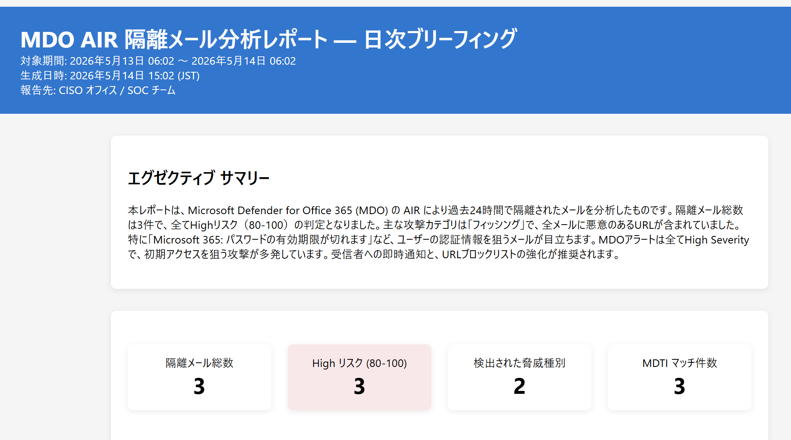
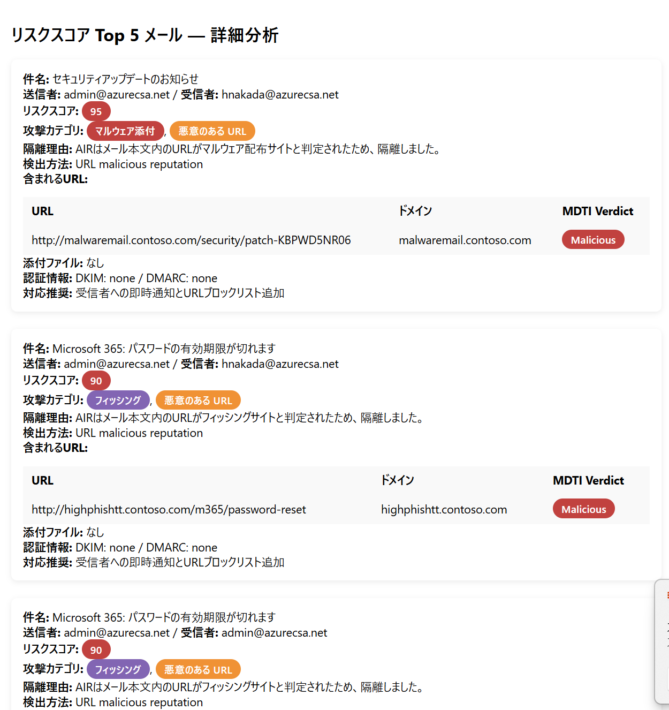
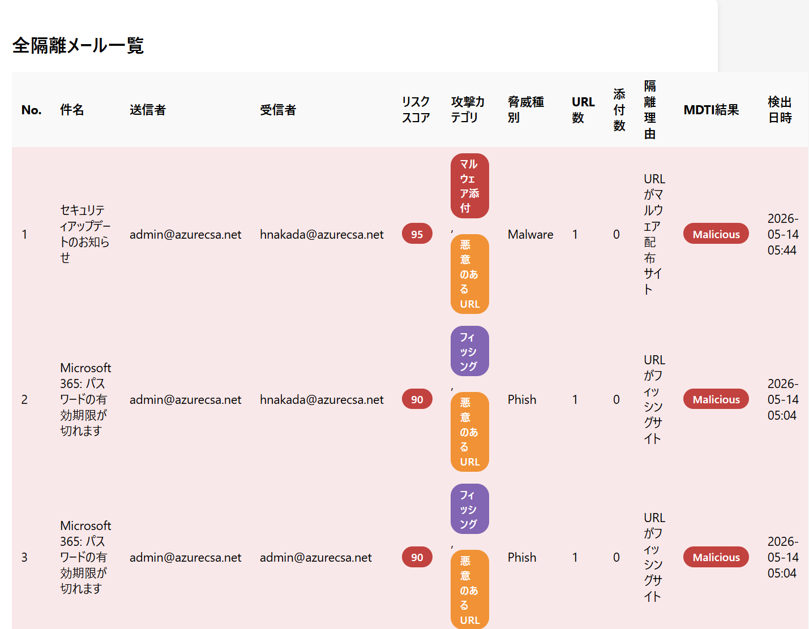
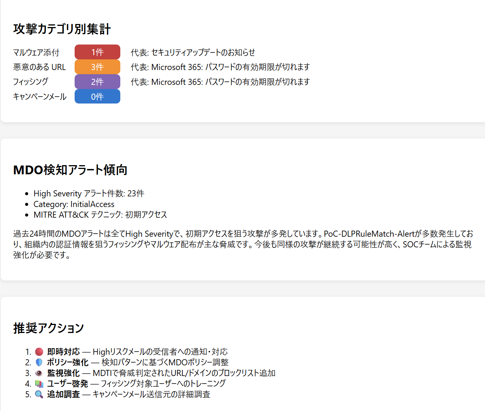

# MDO AIR Quarantine Analyzer

Microsoft Defender for Office 365 (MDO) の **AIR (Automated Investigation and Response)** によって隔離されたメールを日次で分析し、CISO / SOC チーム向けの HTML レポートをメール送信する Security Copilot カスタムエージェントです。

## エージェント概要

| 項目 | 内容 |
|------|------|
| **名前** | MDO AIR Quarantine Analyzer |
| **種別** | Standard Agent (スケジュール実行) |
| **実行間隔** | 24 時間ごと (手動実行も可能) |
| **モデル** | gpt-4.1 |
| **出力形式** | HTML メール (Logic App 経由) |

## 機能

### 1. AIR 隔離メール分析
- `EmailEvents` から過去 24 時間に AIR で隔離されたメールを取得
- 各メールの隔離理由を自然言語で説明

### 2. リスクスコア (0-100)
以下の要素を加算方式で算出:
- マルウェア検出 (+40)
- フィッシング検出 (+35)
- スパム判定 (+10)
- 危険な添付ファイル拡張子 (+15)
- 添付ファイルの脅威名 (+20)
- MDTI で脅威判定された URL (+25)
- 認証失敗 (SPF/DKIM/DMARC) (+10)
- その他の要素 (+5 ずつ)

### 3. 攻撃カテゴリ判定
| カテゴリ | 判定基準 |
|----------|----------|
| **マルウェア添付** | ThreatTypes に Malware、添付ファイルに脅威検出 |
| **悪意のある URL** | MDTI で Malicious/Suspicious、URL が主要な脅威要素 |
| **フィッシング** | ThreatTypes に Phish、認証失敗を伴う送信者偽装 |
| **キャンペーンメール** | BulkComplaintLevel 高値、スパム判定、同一クラスタ |

### 4. MDTI 脅威マッチング
- `EmailUrlInfo` から隔離メール内の URL を抽出
- `ThreatIntelligence.DTI` の `GetReputationForIndicator` で各ドメインの脅威情報を確認
- MDTI の Verdict・Reputation Score をレポートに追記

### 5. 添付ファイル分析
- `EmailAttachmentInfo` から添付ファイルの脅威情報を取得
- ファイル名、種別、SHA256、脅威検出結果を記録

## KQL スキル

| スキル名 | テーブル | 説明 |
|----------|---------|------|
| `GetAIRQuarantinedEmails` | EmailEvents | AIR で隔離されたメール一覧 |
| `GetQuarantinedEmailUrls` | EmailUrlInfo | 隔離メール内の URL 情報 |
| `GetQuarantinedEmailAttachments` | EmailAttachmentInfo | 隔離メール内の添付ファイル情報 |
| `GetMDOAlerts` | AlertInfo | MDO 関連アラートの傾向 |

## 外部スキルセット

| スキルセット | スキル | 用途 |
|-------------|--------|------|
| `ThreatIntelligence.DTI` | `GetReputationForIndicator` | URL/ドメインの MDTI 脅威マッチング |

## レポート構成

1. **エグゼクティブ サマリー** — 隔離メール総数、リスク分布、主要脅威の概要
2. **KPI カード** — 隔離数、High リスク数、脅威種別数、MDTI マッチ数
3. **Top 5 高リスクメール詳細** — リスクスコア・攻撃カテゴリ・隔離理由・MDTI 結果
4. **全隔離メール一覧テーブル** — リスクスコア降順のフルリスト
5. **URL 脅威マッチング結果** — MDTI 参照結果の全テーブル
6. **攻撃カテゴリ別集計** — CSS 棒グラフによる可視化
7. **MDO 検知アラート傾向** — Severity/Category 別分析
8. **推奨アクション** — 優先度付きの対応アクション

## レポートメール サンプル

エージェントが生成する HTML メールのイメージです。

<!-- スクリーンショットを images/ フォルダに配置し、以下のパスを更新してください -->
| セクション | スクリーンショット |
|-----------|-------------------|
| エグゼクティブ サマリー & KPI カード |  |
| Top 5 高リスクメール詳細 |  |
| 全隔離メール一覧 & URL 脅威マッチング |  |
| 攻撃カテゴリ別集計 & 推奨アクション |  |

> **Note**: `images/` フォルダにスクリーンショット画像を配置してください。

## デプロイ手順

### 1. Logic App のデプロイ

ARM テンプレート `MDOAIRQuarantineAnalyzer_LogicApp_ARM.json` をデプロイします。

```bash
az deployment group create \
  --resource-group <YOUR-RESOURCE-GROUP> \
  --template-file MDOAIRQuarantineAnalyzer_LogicApp_ARM.json \
  --parameters emailAddress=<CISO-EMAIL-ADDRESS>
```

デプロイ後、Logic App の Office 365 接続を承認してください。

### 2. Security Copilot にプラグインをアップロード

1. Security Copilot ポータルで **[Settings]** → **[Custom plugins]** → **[Add plugin]**
2. `MDOAIRQuarantineAnalyzer.yaml` をアップロード
3. 設定パラメーターを入力:
   - **LogicAppSubscriptionId**: Logic App のサブスクリプション ID
   - **LogicAppResourceGroup**: Logic App のリソース グループ名
   - **LogicAppWorkflowName**: Logic App 名 (デフォルト: `PluginLogicApp_MDOAIRReport`)

### 3. エージェントの有効化

1. **[Active Agents]** でエージェントを有効化
2. スケジュール実行 (24 時間間隔) が自動で開始されます
3. 手動実行する場合はエージェントをトリガーしてください

## 前提条件

- **Microsoft 365 E5 ライセンス** (Defender for Office 365 Plan 2)
- **Security Copilot** へのアクセス権
- **Microsoft Defender XDR** の Advanced Hunting アクセス権
- **Azure サブスクリプション** (Logic App デプロイ用)
- **Office 365 コネクタ** (メール送信用)
- **MDTI (Microsoft Defender Threat Intelligence)** ライセンス

## ファイル一覧

| ファイル | 説明 |
|----------|------|
| `MDOAIRQuarantineAnalyzer.yaml` | エージェント マニフェスト (メイン YAML) |
| `MDOAIRQuarantineAnalyzer_LogicApp_ARM.json` | Logic App ARM テンプレート |
| `MDOAIRQuarantineAnalyzer_card.html` | プラグイン カード (ビジュアル サマリー) |
| `README.md` | 本ドキュメント |
